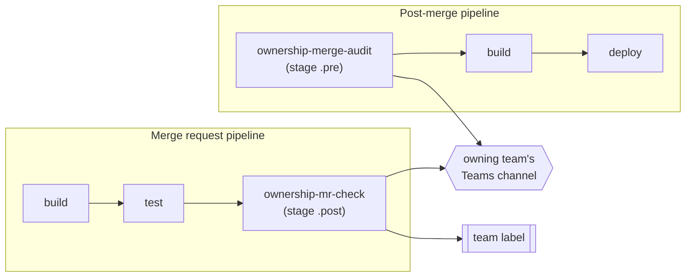

# Design notes

Why this bot exists, what GitLab actually allows on the Free tier, and why the
implementation looks the way it does. The section numbers are referenced from the code
docstrings (`docs/design.md §7.1` and friends), so they are stable.

---

## 1. Context

A monorepo-ish GitLab instance with many teams. Teams own directories, not repositories:
one merge request can touch code owned by three teams, and the people who should review it
usually find out by accident. The goal is a notification that reaches the *owning team*
early, and a record when a merge happens without their approval.

Both signals have to be cheap: no new service to run, no database, no scheduler, and
nothing that can block a build or a deployment.

## 2. Goals

- Tell the owning team when **the pipeline turns green** on a merge request that changes
  their code — as early as that fact is knowable.
- Tell the owning team when an MR **merges without an approval from anyone on that team**.
- Announce **ownership changes** (patterns added to or removed from CODEOWNERS) to the team
  affected, because that is a change to the source of truth and never noise.
- Use the labels teams already have on their dashboards. No new label taxonomy, no
  acknowledgement workflow, no state to keep.
- Fail silently and safely: a notification problem must never fail a pipeline, block a
  merge or delay a deployment.

## 3. Non-goals

- Approving, blocking or gating anything. Approvals here are a **signal**, not a gate.
- Replacing GitLab approval rules (Premium) or CODEOWNERS enforcement (Premium).
- Being a general-purpose event bus. Two conditions, two jobs.

## 4. Verified platform constraints

Checked against GitLab's documentation for **self-managed Free** — every architectural
decision below follows from one of these facts.

| Constraint | Consequence |
| --- | --- |
| `CI_JOB_TOKEN` cannot read MR diffs, cannot read approvals, and cannot write labels | The jobs need a **project access token**; a job alone cannot decide or act |
| Project access tokens work on any license on self-managed GitLab (Premium on GitLab.com); group access tokens are Premium | Use one project access token per repository |
| `GET /projects/:id/merge_requests/:iid/approvals` is Free; `/approval_state` and approval-rule endpoints are Premium | "Who approved?" is answerable; "was it required?" is not |
| Approval rules and CODEOWNERS enforcement are Premium | The bot is a notification layer, not a policy engine |
| **Project webhooks are Free; group webhooks are Premium** | Per-project webhooks are the only universal option — and they still cannot cover the two triggers below |
| **No pipeline runs on MR metadata changes (draft → ready) and none on merge** | "The pipeline is green" is the earliest honest trigger, and the merge audit must ride a post-merge pipeline |
| CI/CD components (`include:component`) and the Catalog are Free | The whole wrapper can be one `include:` line per repository |
| Compliance pipelines are Ultimate | Adoption cannot be forced centrally; it has to be a merge request |
| Group members API (including inherited members) is Free | Rosters can come from groups without Premium |
| CODEOWNERS: **last matching pattern wins**, `*` does not cross `/`, `**` does, and there is **no `!` negation** | Ignore lists and branch scoping cannot live in CODEOWNERS |

### 4.1 Why the checks are split across two pipelines

Condition 1 rides the **merge request pipeline**: it is the only pipeline that exists before
the merge, and its final stage is the first moment "build and tests passed" is true.
Condition 2 rides the **post-merge pipeline**: nothing runs on merge itself, so the audit
happens the next time the default branch is built.

That leaves one honest gap: a merge that produces no post-merge pipeline (docs-only change,
release branch with no pipeline) is not audited. The drift report does not hide it.

**Draft status is deliberately ignored.** Since no pipeline runs when a draft becomes ready,
waiting for "ready" would delay the signal for hours. The pipeline going green is the
trigger; the notification itself shows the draft state.

## 5. Design trade-offs

| Option | Why not |
| --- | --- |
| Scheduled sweeper pipeline that scans all MRs | Two pipelines' worth of API calls to learn something that already happened; worst-case latency equals the schedule; and it needs a bot user with broad read access to every repository |
| Group-level webhook bot + service | Group webhooks are Premium; a long-running service is a new thing to operate, monitor and secure |
| Merge-request pipeline only (no audit) | Loses the post-merge record, which is the only signal for MRs that merged without an owner's approval |
| GitLab's built-in Teams integration | Event-based and file-unaware: it will not tell you the diff is owned by `payments` |

## 6. Architecture — one component, two jobs

A single CI/CD component publishes both jobs. Consumers add one `include:` and nothing else;
neither job requires a `stages:` change, and both are `allow_failure: true`.



### 6.1 `ownership-mr-check` (condition 1)

- Runs only in merge request pipelines (`$CI_PIPELINE_SOURCE == "merge_request_event"`).
- `stage: .post` — always last, so no `stages:` edit is needed in consuming repositories.
- **"Pipeline passed" is verified, not assumed.** Before doing anything, the job lists the
  pipeline's jobs and exits quietly if an earlier job failed without `allow_failure: true`.
  `stage: .post` alone is not relied upon. Set `OWNERSHIP_VERIFY_UPSTREAM=false` to skip
  that API call.
- For every owning team whose label is absent, that is not the author's own team, and that
  has not approved: notify, then add the label.
- Draft and ready MRs behave identically.

### 6.2 `ownership-merge-audit` (condition 2)

- Runs in the post-merge pipeline: `$CI_PIPELINE_SOURCE == "push" && $CI_COMMIT_BRANCH == $CI_DEFAULT_BRANCH`.
- `stage: .pre` — the first thing in the pipeline, non-blocking, and no `stages:` edit.
- Maps the pipeline's commit back to its merge request (merge/squash commit SHA match, then
  the commits API — the one MR-related call `CI_JOB_TOKEN` is allowed to make).
- For every owning team that did not approve: notify, then leave a note carrying a hidden
  marker so a re-run is a no-op.

## 7. Ownership model — CODEOWNERS per repo, metadata centrally

Keeping ownership in CODEOWNERS means an ownership change is reviewed in the same merge
request as the code move, the format is already familiar, and a Premium upgrade enables
native enforcement with zero migration.

A small central `teams.yml` holds only what CODEOWNERS cannot express.

### 7.1 What CODEOWNERS expresses

- **Whole repo → team**: `* @org/teams/platform`
- **Directory → team**: `src/main/java/com/example/payments/** @org/teams/payments`
- **Several owners**: `src/api/** @org/teams/api @org/teams/sre`
- **Sections** (`[Name]`) as grouping labels in the UI (they are not patterns)
- **Last matching pattern wins** — order is meaningful

What it cannot express, and therefore lives in `teams.yml`:

- **No negation.** There is no way to say "everything except this". Ignore lists are applied
  *before* CODEOWNERS matching, which is equivalent in practice: an ignored path never
  reaches the matcher.
- **No branch concept.** CODEOWNERS applies to every branch equally, so branch scoping
  (`branches`, `exclude_branches`) lives in `teams.yml`.
- **No notion of "owned by nobody".** A path matching nothing is *unclaimed*, which the code
  treats as a distinct, reported state rather than as silence.

The reference implementation reads CODEOWNERS from the MR's **target branch**, so an MR
cannot delete a team's ownership patterns to dodge a notification.

### 7.2 Keeping it accurate — the drift report

CODEOWNERS rots quietly: someone moves `payments/` and the pattern now matches nothing.
A scheduled report (not a notification) covers what a per-MR check cannot see:

- **stale patterns** — rules matching zero files in the whole tree
- **uncovered repositories** — no CODEOWNERS, or nothing claimed
- **unclaimed files** — counted per repository, top offenders listed
- **unknown owner tokens** — a token with no `teams.yml` entry resolves to nobody
- **roster problems** — a group or label shared by two teams, a team with no roster source
- **most-ignored paths** — keeps the `ignore:` list honest
- **an ownership index** — pattern → teams → file count, printed for review

### 7.3 `teams.yml`

```yaml
defaults:
  branches: ["**"]
  notify_on: [mr_pipeline_green, merged_without_owner_approval, ownership_changed]
  min_mr_age_minutes: 0        # noise control: ignore hot-fix-sized MRs
  min_owned_files: 1           # noise control: ignore one-line drive-bys
  mentions: []                 # optional Microsoft 365 UPNs to @mention

teams:
  payments:                              # team key
    codeowners_token: "@acme/teams/payments"  # the token as written in CODEOWNERS
    gitlab_group: acme/teams/payments    # preferred roster source
    members: [alice, bob]                # interim/explicit roster
    teams_channel: "Payments Engineering"  # the channel the flow switches on
    label: team::payments                # the team's pre-existing dashboard label
    branches: ["master", "develop", "release/**"]   # target branches this team cares about

ignore: ["**/target/**", "**/dist/**", "**/*.lock", "docs/**"]
ignore_authors: ["renovate-bot", "*-ci-bot"]
skip_label: ownership-bot::skip          # escape hatch for hotfixes and reverts
module_overlay:                          # optional, only for components that move
  - module: "*:payment-core"
    owner: payments
```

Notes that matter:

- **`codeowners_token` is the link** between CODEOWNERS and this file. It defaults to
  `@<gitlab_group>`, so a team with a subgroup needs no extra field; a members-only team
  (no group to derive a token from) still gets a stable `@…` token to write in CODEOWNERS.
  Consequence: when teams later get their own subgroups, CODEOWNERS does not change.
- **`ignore:` wins over CODEOWNERS**, which is how "no notifications for docs or lock files"
  is expressed.
- **`module_overlay:` is normally empty** and exists only for components that genuinely move
  between directories. Identity comes from the nearest `pom.xml` / `package.json`.
- The bot fetches `teams.yml` and the relevant CODEOWNERS file with the bot token.

### 7.4 Branch scoping

`branches` are globs matched against the MR's **target** branch. A team scoped to `prod`
hears nothing about MRs targeting `master`, and — importantly — gets **no label** either,
because the label means "this team was pinged".

### 7.5 Team rosters — group, explicit usernames, or both

"I did an owner approve this?" needs a membership list. Three sources are unioned:

| Source | Notes |
| --- | --- |
| `gitlab_group` | Resolved through `GET /groups/:id/members/all`, so inherited and nested membership comes along. The zero-maintenance path. |
| `members` | Explicit usernames. Works when teams share a single group and no subgroup exists yet. |
| `@user` tokens in CODEOWNERS | A user listed **on the same pattern line** as the team token counts as a member of that team. Same-line association keeps the rule unambiguous. |

An unresolvable roster is treated as "no owner approval" — never as silence. The
notification goes out with `roster_resolved: false`, and the drift report counts it.

## 8. Labels — no new label types

The bot uses the team's **pre-existing** dashboard label and nothing else. There is no
acknowledgement label, no `notified` label, no database.

Absence of the label is the state that matters: once it is present, the team has been told.
Removing it re-arms the notification. That makes the label both the dashboard signal and the
idempotency marker, with no extra state to reconcile.

For the merge audit, where no label exists to reuse, idempotency is a note carrying a hidden
marker: `<!-- ownership-bot:merged:<team> -->`.

## 9. Decision logic

Both decision tables are pure functions — no I/O — which is what makes the behaviour
table-testable.

### 9.1 `ownership-mr-check`

```text
if the MR carries the skip label:                    stop
if the author is in ignore_authors:                  stop

for each team that owns changed files, or whose CODEOWNERS patterns changed:
    if the author is on this team's roster:          skip
    if this team's label is already on the MR:       skip
    if someone on this team already approved:        skip   # D2

    events = []
    if this team's patterns changed:                 events += ownership_changed
    if the green-pipeline ping applies:              events += mr_pipeline_green

    if events is empty:                              skip
    notify(events) → then add the team label
```

The green-pipeline ping applies only when **all** of these hold: the team is in scope for the
target branch, `mr_pipeline_green` is in the team's `notify_on`, and the MR is over the
noise thresholds (`min_mr_age_minutes`, `min_owned_files`).

`ownership_changed` deliberately bypasses branch scope and the thresholds: a change to the
source of truth is never noise. It still respects the author-skip, the label check and the
approval suppression.

Both reasons are combined into a single message (`events: [...]`) so a team never gets two
pings for one MR.

### 9.2 `ownership-merge-audit`

```text
if the MR is not merged:                             stop
if the MR carries the skip label / author ignored:   stop

for each owning team, in scope for the target branch:
    if the author is on this team's roster:          skip
    if someone on this team approved:                skip
    if the audit marker is already on the MR:        skip
    notify(merged_without_owner_approval) → then add the marker note
```

No thresholds here: an audit is a record, not a ping.

### 9.3 Shared behaviour and edge cases

| Situation | Behaviour |
| --- | --- |
| Two teams own one file | Both are notified; one message each, distinct dedupe keys |
| A file is owned by several tokens on one line | Every resolved team is notified |
| Diff truncated by the API (`collapsed`/`too_large`) | `diffs_truncated: true` in the payload; the MR is still evaluated |
| No CODEOWNERS in the repository | Every changed file is unclaimed; log warning, nothing notified |
| Owner token with no `teams.yml` entry | Reported in `problems` and by the drift report, ignored for routing |
| The author's own team owns the code | Skipped — an author learns nothing from a ping |
| Merged MR that was never opened as an MR | Commit→MR lookup returns nothing; the audit exits quietly |

### 9.4 Ownership changes

Because ownership lives in CODEOWNERS, a code move usually arrives *with* a pattern change in
the same MR — often the very MR that should be notified. Reporting the delta is what makes
that safe:

- patterns **removed** from a team's control and patterns **added** are both announced
- the delta is computed from the target-branch CODEOWNERS versus the MR's version
- it is one more value in `events`, not a separate message

## 10. Notification contract

One `POST` per (team, MR) to a Power Automate flow — the only supported Teams path since the
O365 connectors were retired. Headers: `Content-Type: application/json` and
`X-Ownership-Signature: sha256=<hex HMAC>`.

```json
{
  "schema": 1,
  "events": ["mr_pipeline_green"],
  "dedupe_key": "acme/services/payment-service!412:team::payments",
  "trigger": { "pipeline_id": 90210, "job_url": "https://gitlab.example.com/…/jobs/55123",
               "pipeline_source": "merge_request_event" },
  "team": { "id": "payments", "channel": "Payments Engineering", "label": "team::payments",
            "branches": ["master"], "mentions": [], "roster_resolved": true },
  "merge_request": { "project_path": "…", "iid": 412, "title": "…", "url": "…",
                     "author": { "username": "…", "name": "…" }, "state": "opened",
                     "draft": false, "source_branch": "feature/x", "target_branch": "master" },
  "ownership": { "source": "CODEOWNERS@master",
                 "matched": [ { "kind": "codeowners", "value": "src/**", "files": ["…"] } ],
                 "files_total": 7, "files_owned": 5, "files_unclaimed": 1,
                 "diffs_truncated": false },
  "ownership_change": { "file": ".gitlab/CODEOWNERS", "added": [], "removed": [] },
  "approvals": { "approved_by": ["alice"], "owners_approved": ["alice"],
                 "checked_at": "2026-09-20T09:00:00Z" },
  "actions_taken": ["notified", "label_added:team::payments"]
}
```

The flow recipe:

1. Recompute the HMAC over the raw body and compare; reject on mismatch.
2. `Switch` on `team.channel` → post to the matching Teams channel.
3. Adapt the wording to `events`: `mr_pipeline_green` is a heads-up on an open MR;
   `merged_without_owner_approval` is explicitly framed as a post-merge record, not a request
   to revert; `ownership_changed` lists the patterns that moved.
4. Mention any `team.mentions`.
5. Respond `202` immediately and post asynchronously, so GitLab never waits on Teams.

## 11. Failure handling, security, observability

- **Every pipeline command exits 0**, including after a GitLab or Teams failure. A
  notification problem must never fail a build or delay a deployment.
- **Webhook first, label second**: if the notification fails, the label is not applied, so
  the next pipeline run retries instead of silently dropping the ping.
- **The bot token** is a project access token with `api` + `write_repository`, stored as a
  masked, protected CI/CD variable. It is never echoed.
- **The HMAC secret** is shared with the Power Automate flow by configuration only.
- **Observability** is the job log plus `decision.json`, uploaded as an artifact: every
  decision, the reason, the files involved and the actions taken.
- Group-level CI/CD variables are readable by project Maintainers — treat them as
  configuration, not as a secret store.

## 12. Rollout

| Phase | What happens |
| --- | --- |
| 0 | Publish the image; create the manifest repository holding `teams.yml` |
| 1 | Bootstrap CODEOWNERS drafts from a written intent mapping (appendix B) |
| 2 | Enable the component with `mode: report` for a week — decide and log, write nothing |
| 3 | Open the CODEOWNERS + `include:` MRs, a few repositories at a time |
| 4 | Switch the pilot to `notify`, verify both conditions by hand, then continue the rollout |
| 5 | Turn on the weekly drift report |

`mode` has three values: `report` (decide, log, write nothing), `label` (write labels only),
`notify` (labels + Teams).

## 13. Test strategy

- **Table-driven unit tests** for the CODEOWNERS parser: last-match-wins, anchoring, `*`
  versus `**`, `{a,b}`, `[abc]`, `?`, sections, comments, invalid lines, unknown tokens.
- **`teams.yml` policy tests**: defaults/overrides, required fields, token derivation, branch
  scope, thresholds, roster union, validation problems.
- **A decision matrix** covering every row of §9, including the deliberate oddities (no draft
  gate, ownership changes bypassing branch scope, an owner approval suppressing everything).
- **Payload contract tests**: the exact JSON of §10, the HMAC format, delivery order.
- **Runner tests with a stub client**: report/label/notify modes, webhook-before-label
  ordering, label left unapplied when the notification fails, note idempotency, the
  upstream-failure guard.
- **Offline end-to-end**: `examples/` runs both commands with no network.

## 14. Open questions

- How to cover merges that produce no post-merge pipeline (§4.1).
- Who owns turning *unclaimed* files into claimed patterns. The drift report lists them; if
  nobody acts on it, the report becomes noise.

## 15. Roadmap

- Suggested owners from git history for unclaimed directories in the drift report (the
  bootstrap script already has it).
- Optional Slack/Matrix notifiers behind the same payload contract.
- A `gitlab-ci-lint`-style check that the rendered component is valid in a scratch project.

## Appendix A — Glossary

| Term | Meaning |
| --- | --- |
| **Owner token** | The `@…` or email token written in CODEOWNERS; resolved through `teams.yml` |
| **Owning team** | The team a changed file resolves to |
| **Unclaimed** | A changed file that no CODEOWNERS pattern matches |
| **Ignore list** | `ignore:` globs applied before CODEOWNERS matching |
| **Roster** | The usernames credited with an approval for a team |
| **Condition 1** | The green-pipeline notification (`ownership-mr-check`) |
| **Condition 2** | The post-merge audit (`ownership-merge-audit`) |
| **Stale pattern** | A CODEOWNERS rule that matches no file in the tree |
| **Drift** | The accumulated difference between `teams.yml`/CODEOWNERS and reality |

## Appendix B — Bootstrapping CODEOWNERS

Nobody wants to write CODEOWNERS for fifty repositories by hand, and nobody should automate
the *decisions*. The split that works:

1. A human writes an **intent mapping**: repository → pattern → team token, plus a fallback
   owner.
2. `scripts/bootstrap_codeowners.py` renders it into a draft CODEOWNERS per repository,
   validates it against `teams.yml`, and reports **what the draft leaves unclaimed** so the
   gaps are decided deliberately. With `--suggest-from-history` it also proposes owners from
   recent commit authors, as a suggestion only.
3. `scripts/rollout.py` opens one merge request per repository containing the CODEOWNERS and
   the `include:` of the component — dry-run by default, and it refuses to touch an existing
   CODEOWNERS or an `include:` shape it does not understand, reporting those for a human.

**The Premium endgame.** If the instance ever moves to Premium, the same CODEOWNERS files can
be enforced natively (approval rules, "Code Owners" approval) with no migration: the tokens
already point at the right groups. This bot then becomes the notification layer on top of
enforcement rather than a substitute for it.

## Appendix C — Alternative considered and rejected: webhook-only bot

A project webhook on merge request events, handled by a service, could notify on open/update
instead of on green. Rejected because it needs a long-running service with broad read access
to every repository, it notifies *before* the code is known to build, and it cannot tell
whether the pipeline passed. Riding the pipelines that already exist costs nothing extra to
operate and gives strictly better signal.
